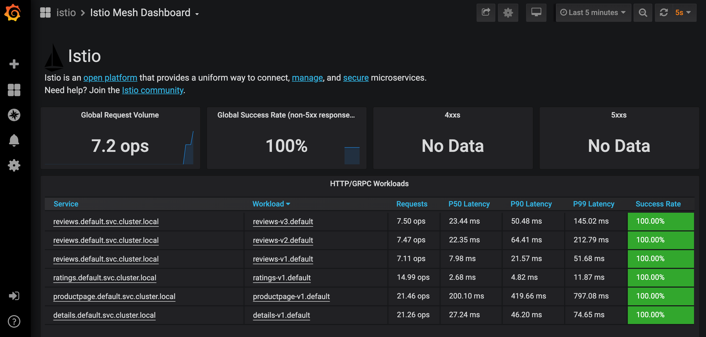
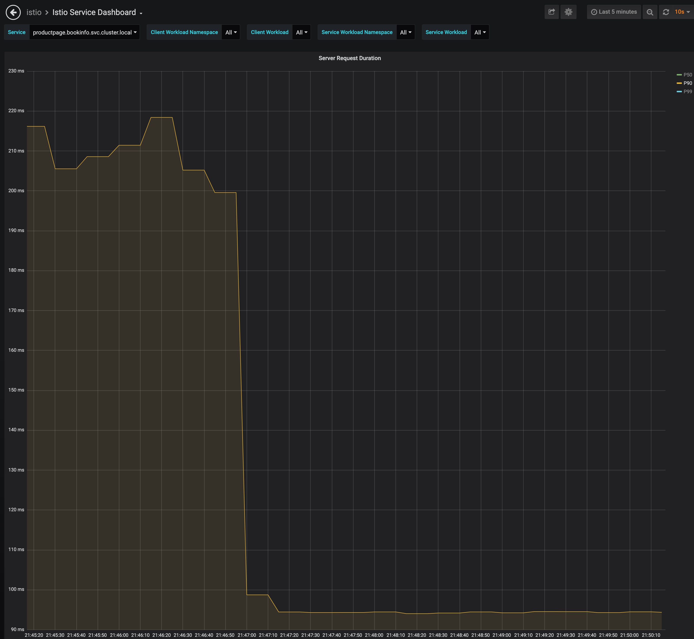

# OpenShift HPA using custom metrics from ServiceMesh (Istio) Prometheus


Tested on OpenShift 4.4 and ServiceMesh Operator 1.1.6

## Install ServiceMesh

Install the Operator, and deploy control plane to `istio-system`

Create `smcp` and `smmr` in `istio-system`

## Deploy the BookInfo App 

Follow instructions here https://docs.openshift.com/container-platform/4.4/service_mesh/service_mesh_day_two/ossm-example-bookinfo.html

Here is an example as shortcut:

Create a project/namespace `bookinfo`
```
oc new-project bookinfo
```
Add `bookinfo` to the `smmr`
```
oc -n istio-system patch --type='json' smmr default -p '[{"op": "add", "path": "/spec/members", "value":["'"bookinfo"'"]}]'
```
Verify
```
oc get smmr -n istio-system
``` 
```                                            
NAME      MEMBERS
default   [default bookinfo]
```
Deploy the BooInfo App
```
oc apply -n bookinfo -f https://raw.githubusercontent.com/Maistra/istio/maistra-1.1/samples/bookinfo/platform/kube/bookinfo.yaml
```
Deploy the networking for the App
```
oc apply -n bookinfo -f https://raw.githubusercontent.com/Maistra/istio/maistra-1.1/samples/bookinfo/networking/bookinfo-gateway.yaml
```
Deploy destination rules none mTLS
```
oc apply -n bookinfo -f https://raw.githubusercontent.com/Maistra/istio/maistra-1.1/samples/bookinfo/networking/destination-rule-all.yaml
```
Get the GATEWAYURL
```
export GATEWAY_URL=$(oc -n istio-system get route istio-ingressgateway -o jsonpath='{.spec.host}')
echo GATEWAY_URL=http://$GATEWAY_URL
```
Confirm app is running
```
curl -o /dev/null -s -w "%{http_code}\n" http://$GATEWAY_URL/productpage
```
Verify the Pods have 2 containers each
```
oc get pods -n bookinfo
```

## Generate Load against App
You can use `hey` to generate load
```
hey -z 30m -c 10 http://$GATEWAY_URL/productpage
```

## Verify that you can access istio prometheus instance metrics

Get the route to prometheus and open in your browser
```
open https://$(oc get route -n istio-system prometheus -o jsonpath='{.spec.host}')
```

Here are some metrics queries you can try in prometheus dashboard

To get the success request volumen (ops)
```
round(sum(irate(istio_requests_total{reporter="destination",destination_service_name="productpage",response_code!~"5.*"}[5m])) by (destination_service_name), 0.001)
```

To get the success request 90 percentile
```
histogram_quantile(0.90, sum(irate(istio_request_duration_seconds_bucket{reporter="destination",destination_service_name="productpage",response_code!~"5.*"}[1m])) by (le,destination_service_name))
```

## Verify that you can access istio grafana instance metrics

Get the route to prometheus and open in your browser
```
open https://$(oc get route -n istio-system grafana -o jsonpath='{.spec.host}')
```

## Verify App is being instrumented by Istio Mesh metrics

Configure Istio and validate that Prometheus is working for istio enabled apps.
In this example we are using the Istio BookInfo example using `bookinfo` namesapce



There are two metrics we could use to scale out the deployment, requests ops, or percentile duration/latency.


## Install prometheus-adapter

We are going to follow the OpenShift 4.4 documentation here https://docs.openshift.com/container-platform/4.4/monitoring/exposing-custom-application-metrics-for-autoscaling.html

instead of using `default` namespace for the custom metrics apiserver we are going to use `custom-metrics`

Create namespace `custom-metrics`
```
oc new-project custom-metrics
```
Create configmap for CA certs following OpenShift 4.3 documentation here https://docs.openshift.com/container-platform/4.3/authentication/certificates/service-serving-certificate.html#add-service-certificate-configmap_service-serving-certificate
```
oc create cm serving-certs-ca-bundle -n custom-metrics 
oc annotate configmap -n custom-metrics serving-certs-ca-bundle service.beta.openshift.io/inject-cabundle=true
oc get cm -n custom-metrics serving-certs-ca-bundle -o yaml 
```

### Get the username and password from Grafana config map
```
oc get cm -n istio-system istio-grafana -o yaml 
```
Take the values for `basicAuthUser` and `basicAuthPassword` 
Edit the file `deploy/manifests/prometheus-adapter-prometheus-config.yaml`
Set the user `username` and `password`

### Update the image tag for the Prometheus Adapter

```
kubectl get -n openshift-monitoring deploy/prometheus-adapter -o jsonpath="{..image}"
```
Replace the image url in the file `deploy/manifests/custom-metrics-apiserver-deployment.yaml`

### Deploy Adapter

```
oc create -f deploy/manifests/
```

Check that the custom metrics are registered
```
oc get --raw /apis/custom.metrics.k8s.io/v1beta1 | jq .
```
The out should contain the metrics to use in the HPA
```json
{
  "kind": "APIResourceList",
  "apiVersion": "v1",
  "groupVersion": "custom.metrics.k8s.io/v1beta1",
  "resources": [
    {
      "name": "services/istio_requests_per_second",
      "singularName": "",
      "namespaced": true,
      "kind": "MetricValueList",
      "verbs": [
        "get"
      ]
    },
    {
      "name": "namespaces/istio_requests_per_second",
      "singularName": "",
      "namespaced": false,
      "kind": "MetricValueList",
      "verbs": [
        "get"
      ]
    },
    {
      "name": "namespaces/istio_request_duration_seconds_p90",
      "singularName": "",
      "namespaced": false,
      "kind": "MetricValueList",
      "verbs": [
        "get"
      ]
    },
    {
      "name": "services/istio_request_duration_seconds_p90",
      "singularName": "",
      "namespaced": true,
      "kind": "MetricValueList",
      "verbs": [
        "get"
      ]
    }
  ]
}
```

Check the values
```
oc get --raw "/apis/custom.metrics.k8s.io/v1beta1/namespaces/bookinfo/services/*/istio_request_duration_seconds_p90"  | jq .
```

Select which hpa to apply

To use `istio_requests_per_second`
```
oc create -f hpa-productpage-rps.yaml
```

To use `istio_request_duration_seconds_p90`
```
oc create -f hpa-productpage-p90.yaml
```

Use watch and describe to see the autoscaling in action
```
watch oc describe hpa productpage-v1 -n bookinfo
```
The output will be refresed every 2 seconds.
```
Name:                                                                          productpage-v1
Namespace:                                                                     bookinfo
Labels:                                                                        <none>
Annotations:                                                                   <none>
CreationTimestamp:                                                             Tue, 07 Apr 2020 21:46:14 -0400
Reference:                                                                     Deployment/productpage-v1
Metrics:                                                                       ( current / target )
  "istio_request_duration_seconds_p90" on Service/productpage (target value):  94m / 190m
Min replicas:                                                                  1
Max replicas:                                                                  5
Deployment pods:                                                               2 current / 2 desired
Conditions:
  Type            Status  Reason               Message
  ----            ------  ------               -------
  AbleToScale     True    ScaleDownStabilized  recent recommendations were higher than current one, applying the highest recent recommendation
  ScalingActive   True    ValidMetricFound     the HPA was able to successfully calculate a replica count from Service metric istio_request_duration_seconds_p90
  ScalingLimited  False   DesiredWithinRange   the desired count is within the acceptable range
Events:
  Type    Reason             Age   From                       Message
  ----    ------             ----  ----                       -------
  Normal  SuccessfulRescale  79s   horizontal-pod-autoscaler  New size: 2; reason: Service metric istio_request_duration_seconds_p90 above target
```

As you can see in the graph, HPA scaled the productpage service up to 2 replicas, and the response duration went down from 200ms to 90ms

